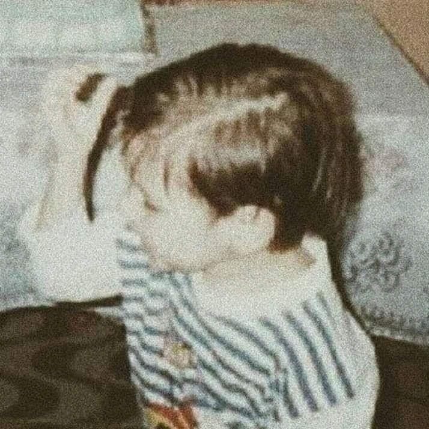

  

  

    
    
  

  
  
Olá,

  
Me chamo Rafael de Lima, e atualmente curso o 5º período letivo do <strong>Bacharelado em Sistemas de Informação</strong> na Universidade Federal do Estado do Rio de Janeiro, a UNIRIO. Possuo o diploma de <strong>Técnico em Desenvolvimento de Sistemas</strong> pelo Colégio Pedro II, onde iniciei minha jornada de formação em TI.

  
Participo do projeto de pesquisa <strong>Construção Colaborativa Online por Multidões de Caminhos de Aprendizagem em Computação</strong>, onde estudo técnicas de gamificação de plataformas digitais e projeto, sob orientação de profissionais incríveis, a sua aplicação em um sistema em estágio de desenvolvimento, <strong>a LearningCurve</strong>.

  
Tenho paixão por aprender e me desenvolver na área de tecnologia, em especial a <strong>Engenharia de Software</strong> e <strong>Análise e Projeto de Sistemas</strong>. Estou sempre em busca de novas oportunidades de aprendizado e crescimento pessoal e profissional, e acredito que posso contribuir de forma significativa em projetos desafiadores e inovadores.

  
Se você se interessou pelo meu perfil e gostaria de saber mais sobre minhas experiências e habilidades, não hesite em entrar em contato comigo. Estou à disposição para conversar e esclarecer qualquer dúvida.

